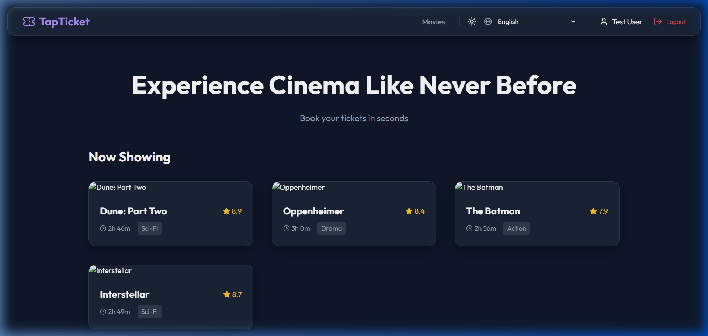
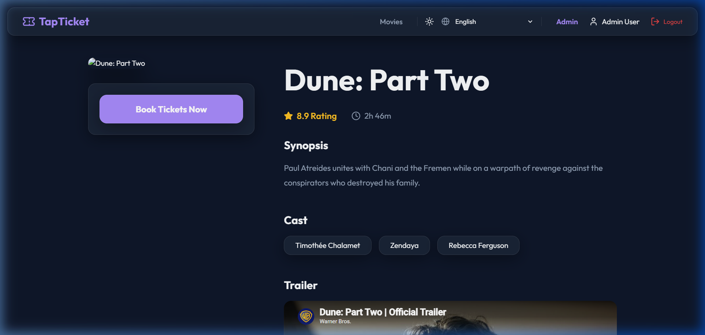
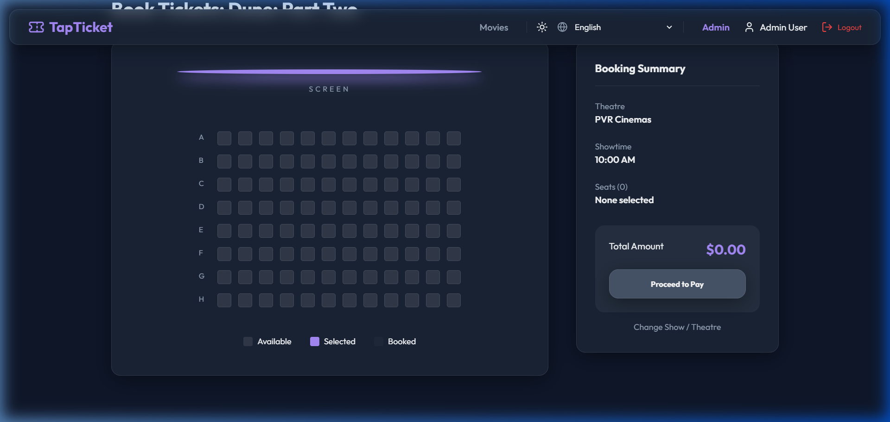
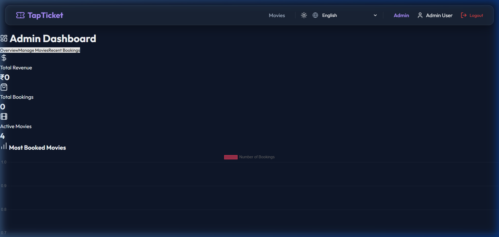

# TapTicket 🎟️

TapTicket is a modern, real-time, and localized movie ticket booking application built with the MERN stack (MongoDB, Express, React, Node.js), WebSockets (Socket.io), and Framer Motion. It offers a premium and responsive user experience for moviegoers, along with a powerful analytics dashboard for administrators.

---

## ✨ Key Features

- **Real-Time Seat Booking**: Powered by Socket.io, seat status changes and selections are updated instantly across all connected clients to prevent double booking.
- **Interactive Seat Mapping**: Dynamic seating grid categories (Gold, Premium, Regular) with custom pricing.
- **Multi-language Support (i18n)**: Fully integrated localization framework utilizing `i18next` for seamless language switching (e.g., between English and Hindi).
- **PDF Ticket Generation**: Downloads detailed ticket PDFs using `jspdf` and `jspdf-autotable` upon successful booking.
- **Admin Dashboard**: Visual analytics with graphs (Chart.js) detailing revenue, movie bookings, active shows, and seat occupancy, alongside management tools for movies and shows.
- **Notification Services**: Web push notifications (via Web-Push VAPID) and automated email scheduling for bookings using `nodemailer` and `node-cron`.
- **Responsive Premium Design**: Beautiful, animated dashboard layouts, glassmorphism elements, and responsive pages styled with custom CSS and animated with `framer-motion`.

---

## 📸 Screenshot Walkthrough

### 1. Movie Discovery Homepage

* **What you see**: The landing page of TapTicket displaying currently active and trending movies.
* **Key Features**: Users can browse movies, see ratings and duration badges, view genre tags, and search/filter movies directly. The interface is localized, allowing users to dynamically switch display languages (e.g., English and Hindi).

---

### 2. Movie Details & Showtimes

* **What you see**: The detailed profile view for a selected movie (e.g., *Dune: Part Two*).
* **Key Features**: Displays critical metadata including the plot summary, genres, cast list, and embedded official trailer. Below the details, users can browse available theatres, locations, and choose specific showtimes.

---

### 3. Real-Time Seating Layout & Booking

* **What you see**: The interactive seating grid for booking a specific showtime.
* **Key Features**: Seats are dynamically color-coded by tier (Gold, Premium, Regular) with custom pricing. Powered by WebSockets (`Socket.io`), seat selection states sync in real-time across all connected clients to prevent double-booking. Once seats are selected, the user can proceed to confirm bookings and download their PDF ticket.

---

### 4. Admin Analytics Dashboard

* **What you see**: The management and analytics portal restricted to administrator accounts (users registered with `@admin.com` emails).
* **Key Features**: Displays visual charts (using `Chart.js` and `react-chartjs-2`) tracking overall revenue, movie ticket sales distribution, active show counters, and seat occupation percentages. It also provides administrative tools for managing the movie listings and shows database.

---

## 🛠️ Technology Stack

### Frontend
- **Framework**: React 19 (Vite)
- **Routing**: React Router DOM (v7)
- **Styling**: Vanilla CSS (Premium theme, Glassmorphism, Responsive layout)
- **Animations**: Framer Motion
- **Icons**: Lucide React
- **Localization**: i18next & react-i18next
- **Real-Time updates**: Socket.io-client
- **Charts/Analytics**: Chart.js & react-chartjs-2
- **PDF Export**: jsPDF & jsPDF-AutoTable

### Backend
- **Runtime**: Node.js
- **Framework**: Express (v5)
- **Database**: MongoDB & Mongoose
- **Real-Time Server**: Socket.io
- **Security/Auth**: JSON Web Tokens (JWT) & bcryptjs
- **Background Tasks**: Node-cron (for scheduled checks)
- **Notifications**: Web-Push (Web Push notifications), Nodemailer (Emails)

---

## 📁 Project Structure

```text
TapTicket/
├── client/                 # React frontend (Vite)
│   ├── src/
│   │   ├── components/     # Reusable UI components
│   │   ├── context/        # React context (Auth context, etc.)
│   │   ├── pages/          # Home, Auth, Movie Details, Booking, Profile, Admin Dashboard
│   │   ├── utils/          # Utility scripts (Notifications, helpers)
│   │   └── i18n.js         # Localization configuration
│   └── package.json
├── server/                 # Express backend
│   ├── models/             # MongoDB Mongoose schemas (User, Movie, Booking)
│   ├── routes/             # Express route endpoints (auth, movies, bookings, admin)
│   ├── services/           # Nodemailer & push notifications handlers
│   ├── utils/              # Helper utilities & Cron jobs
│   ├── seed.js             # Initial database seed script
│   └── package.json
└── README.md               # Main project documentation
```

---

## 🚀 Getting Started

### Prerequisites
- **Node.js** (v16+)
- **MongoDB** instance (Local or Atlas)

### 1. Clone the repository
```bash
git clone https://github.com/ChandanVarshney031/TapTicket.git
cd TapTicket
```

### 2. Backend Setup
1. Navigate to the server folder:
   ```bash
   cd server
   ```
2. Install dependencies:
   ```bash
   npm install
   ```
3. Configure environment variables. Create a `.env` file in the `server` directory and specify the following variables:
   ```env
   PORT=5000
   MONGODB_URI=your_mongodb_connection_string
   JWT_SECRET=your_jwt_secret_key
   NODE_ENV=development

   # VAPID Keys for Push Notifications
   VAPID_PUBLIC_KEY=your_public_vapid_key
   VAPID_PRIVATE_KEY=your_private_vapid_key

   # SMTP Settings (For Emails)
   SMTP_HOST=smtp.ethereal.email
   SMTP_PORT=587
   SMTP_USER=your_smtp_username
   SMTP_PASS=your_smtp_password
   ```
4. Seed the database with mock movies & showtimes:
   ```bash
   node seed.js
   ```
5. Start the development server:
   ```bash
   npm run dev
   ```

### 3. Frontend Setup
1. Navigate to the client folder (from the project root):
   ```bash
   cd client
   ```
2. Install dependencies:
   ```bash
   npm install
   ```
3. (Optional) Configure environment variables. Create a `.env` file in the `client` directory if you need to point to a custom server:
   ```env
   VITE_API_URL=http://localhost:5000
   VITE_SOCKET_URL=http://localhost:5000
   ```
4. Start the frontend development server:
   ```bash
   npm run dev
   ```
5. Open your browser and navigate to `http://localhost:5173`.

---

## 🔒 License

This project is licensed under the **ISC License**.
